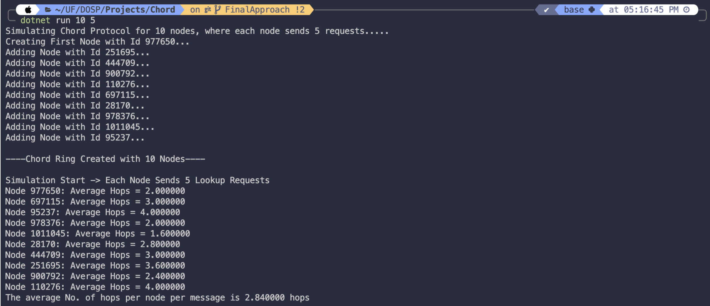
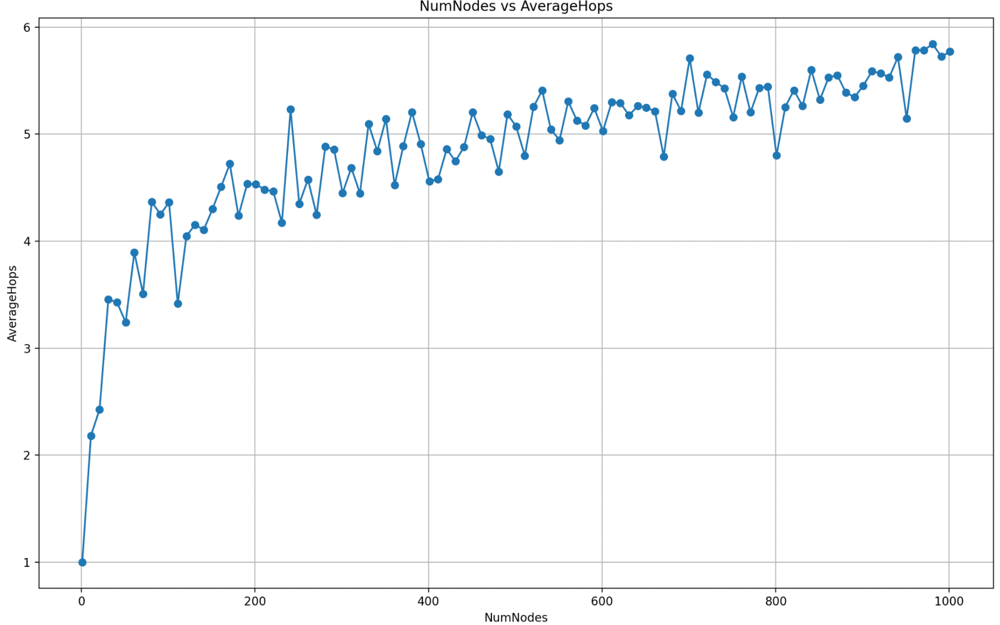

# DOSP Programming Assignment 2

## Team Information

- **Girish Vinayak Salunke**
  - Email: gsalunke@ufl.edu
  - UFID: 88908382
- **Janhavi Shriram Athalye**
  - Email: janhavi.athalye@ufl.edu
  - UFID: 76926526

## Environment Setup

The project is compatible with Windows and macOS operating systems. It requires the following software setup:

- F# .NET framework
- Visual Studio Code IDE
- AKKA actor framework

## Compilation Instructions

To compile and run the project, follow these steps:

1. Clone the repository.
2. Open the folder in Visual Studio Code.
3. Use the `dotnet run` command with the following parameters: 
   - Number of nodes
   - Syntax: <b> dotnet run \<numNodes> \<numRequests> </b>
   - eg. dotnet run 5 10

Here numNodes represents the desired number of peers in the network, and numRequests is the number of lookup requests each peer should make. Each peer will send one request per second.

## Implementation

Within our system, we utilize two distinct types of actors ie Node Actors and Simulator Actors. The primary actors in operation are the Nodes, responsible for forming a ring, exchanging messages, and responding to one another's communications. Additionally, we introduce a computational actor with a specialized role: collecting data on the hops taken by Nodes to transmit and reply to messages, then calculating the average. Importantly, this computational actor operates autonomously, without any disruptive influence on the Nodes.
Our Chord protocol implementation showcases a range of pivotal features. We initialize a network ring comprising a user-defined quantity of nodes, each assigned a unique identifier. These nodes are endowed with finger tables, enhancing their ability to establish connections and perform efficient lookups. Moreover, our system accommodates dynamic node additions, ensuring that nodes seamlessly integrate by
automatically updating their finger tables. Key lookups guarantee robust and efficient searches within our peer-to-peer network. To assess system performance, we have developed an all-encompassing simulator that meticulously records the hops required for lookup requests. In summary, our implementation excels in the establishment and maintenance of network rings, supports the dynamic inclusion of nodes, enhances key lookup efficiency, and integrates a performance evaluation tool.

## Code Structure

| File Name         | Description |
|-------------------|-------------|
| `Program.fs`      | This file contains the entry point and main logic for the Chord simulation program, orchestrating the setup and execution of the simulation.|
| `Gossip.fsproj`   | This is a project file that defines the structure and dependencies for a Chord-based distributed hash table (DHT) implementation. |
| `Node.fs`  | This file contains the implementation of a Chord node Actor using the Akka Framework, which participates in the Chord DHT network, handles messages, and performs node-related operations. |
| `SupportFunctions.fs`    | This file contains utility functions and support functions used in the Chord DHT implementation, providing essential helper functions. |
| `ChordMessageTypes.fs`     | This file defines various message types and data structures used for communication and message passing between nodes in the Chord DHT network. |
| `Config.fs`         | This file includes configuration settings and parameters used in the Chord simulation, allowing customization of various aspects of the DHT network.|
| `Simulator.fs`| This file contains the simulator Actor definition and logic used to simulate the behavior and interactions of Chord. It keeps track of the number of hops and requests made by each node and calculates the value of average hops when the simulation ends. |
| `genGraph.py`   | This Python script performs a sequential loop (i) from 1 to 'n' (provided as a command line argument). In each iteration, it executes the command 'dotnet run i req' (req is a command line argument that stores the number of requests per node). Once all iterations are completed, the script will read the data from a CSV file and generate a graph that illustrates the relationship between the number of nodes (numNodes) and the average number of hops (avgHops).|
| `output.csv`      | This file stores the specific output or results generated during the Chord simulation, which might include the numNodes, numRequests and Average No of hops. This file is used to generate a Graph. |

## Output Analysis

The program outputs the average number of hops (node connections) required to deliver a message, calculated as:
**Average number of hops** =
(Sum of the number of hops for all requests for all nodes) / (numRequests * numNodes)

## Sample Outputs

Below is a sample screenshot of the program output, showcasing the performance of our Chord protocol implementation for > dotnet run 10 5

## Average Hop Count Results
We conducted multiple experiments with varying numbers of nodes sending 10 requests each. The output.csv file shows the detailed results of the file. The table below shows a few significant data points.

| Number of Nodes | Number of Requests | Average Hops |
|-----------------|--------------------|--------------|
| 1               | 11                 | 2.018        |
| 11              | 34                 | 3.8127       |
| 101             | 100                | 3.6706       |
| 501             | 60                 | 4.4150       |
| 1001            | 110                | 5.4893       |

### Performance Visualization

Here is a graph that shows the relationship between the number of nodes and the average hop count derived from the test results of our program:

## Largest Network

The largest network we managed to deal with had 1750 nodes, and the average hop count for this network was 5.614235 hops.

## Assumptions

1. Our first assumption in the Chord protocol is that there is a trade-off between consistency and availability. We think that the protocol leans towards prioritizing availability and partition tolerance over rigid consistency. So, even in the event of network partitions or failures, the system will strive to maintain responsiveness and availability, potentially allowing for operations that may not be immediately consistent.
2. Our second assumption is that when implementing the Chord protocol using the Akka framework and actor model, the actors will handle concurrent requests and messages efficiently. We assume that the actor model inherently supports high levels of concurrency and parallelism.

## Conclusion
Our implementation of the Chord protocol using F# and the AKKA actor framework demonstrates the feasibility of creating a scalable peer-to-peer network for internet applications. The average hop count provides insights into the efficiency of key lookup in such networks. The largest network we managed to deal with had 1750 nodes, and the average hop count for this network was 5.614235 hops. Overall, we have successfully achieved a scalable and fault-tolerant distributed hash table. The Chord protocol's decentralized nature, coupled with Akka's efficient message-passing mechanism, has enabled us to navigate a dynamic network environment with grace.

