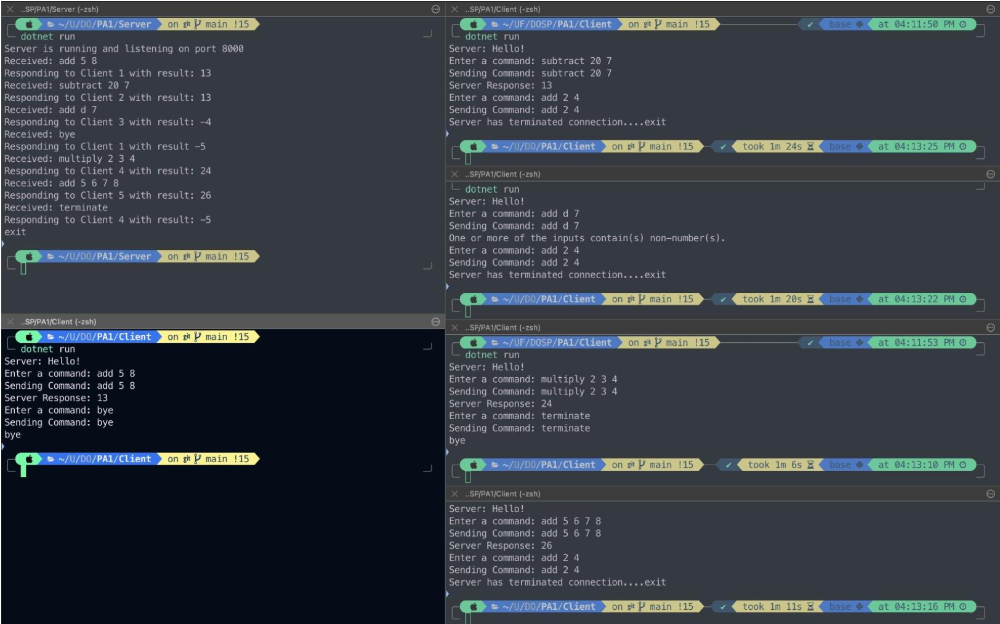
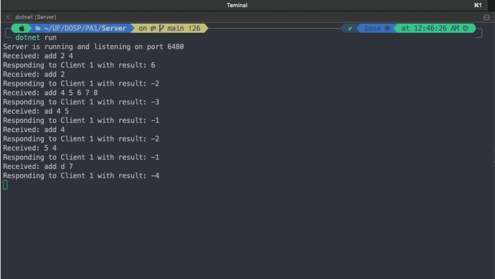
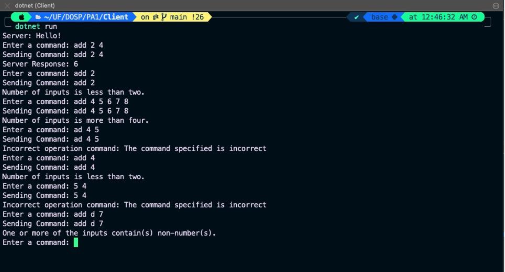

# DOSP Programming Assignment 1

## Team Information

- **Girish Vinayak Salunke**
  - Email: gsalunke@ufl.edu
  - UFID: 88908382
- **Janhavi Shriram Athalye**
  - Email: janhavi.athalye@ufl.edu
  - UFID: 76926526

## Environment Setup

The project is compatible with Windows and macOS operating systems. It requires the following software setup:

- F# .NET framework
- Visual Studio Code IDE
- AKKA actor framework

## Compilation Instructions

To compile and run the project, follow these steps:

- Unzip the PA1_Team11 folder from the zipped packet and open it in Visual Studio Code
- Open Server.fs and Client.fs in different terminals in VS code
- Multiple client terminals can be opened the same way
- In the server and client terminals, run the command: dotnet build for it to compile the
respective codes

## Running the Code

- Run the command dotnet run in the server terminal
- Additionally run this in all the client terminals
- The server starts listening and establishes a connection with all the clients as soon as
they come online
- The server is ready to receive commands from the clients
- The server responds with a Hello! to depict that the connection is established and this
will display on the client terminal
- The user can then proceed with trying out all the Arithmetic operations
- Port number is hardcoded to 6480
- We have used the IP address as: 127.0.0.1
- You can edit the port number of your choice by editing the server and client code file

## Dependencies
No particular dependency.

## Code Structure
| File       | Function |
|------------|----------|
| `server.fs`| The server.fs file is responsible for establishing a TCP connection with the client. It contains code blocks for initiating the connection and executing commands received from the client. Comments are added above code blocks for clarity. |
| `client.fs`| The client.fs file focuses on connecting with the server. Once connected, it allows the user to enter commands and receive outputs in a recursive manner until the program is exited or terminated. |

This table provides an overview of the key files in the project and their respective functionalities.

## Results

Now the following instructions can be given to test the objectives given in the question:
As we can see below, 1 server terminal and 5 client terminals have been opened. All the inputs
required to be tested and the outputs have been displayed on both, the server and the client
side.

### General Commands

### Exception Handling

## Analysis of Results

The results obtained are in accordance with the given objective. For example, the command
“add 5 6 7 8” prints that command on the server side and returns the result to the client side.
The command “add d 7” returns -4 which is in accordance with rule 4 of exception handling. The
command “5 4” returns -1 which shows that the precedence in error codes has been taken care
of. The “subtract 20 7” command returns 13 to the client. The “multiply 1 2 3 4” returns 24 to
the client. This implies all the operations asked in the question can be executed with the
required exception handling. The command “terminate” terminates all server-client connections
and shuts down the server from accepting any new connection. This can be tested by trying to
press enter from any of the other client terminals apart from the one that sent the terminate
command. All processes are stopped and there is graceful termination. Sending “bye” from any
client terminates the connection of the server with that client only. This can be tested and seen
in the above screenshot as we can continue to send other commands from other clients.

## Abnormalities

There have been no abnormalities while testing to the best of our knowledge.

## Conclusion

All the objectives of the assignment have been met.

